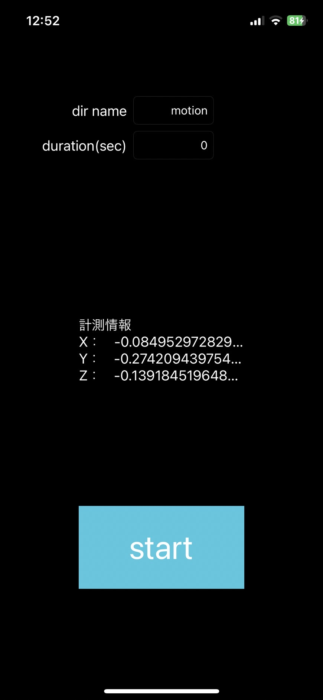
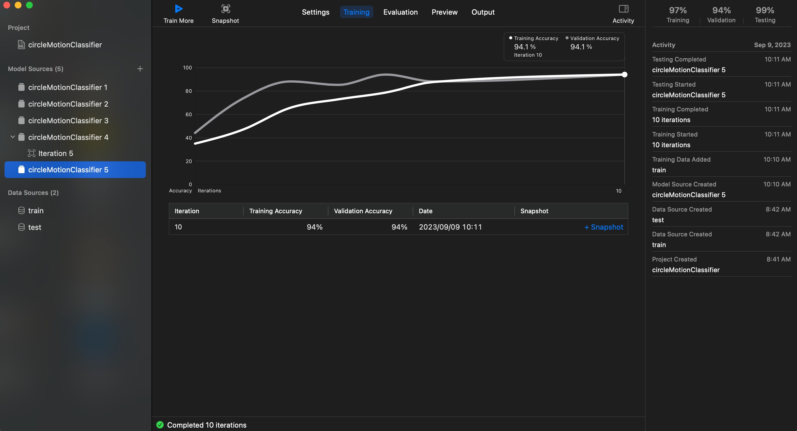

# motion_detect_createML

- RPGゲームにモーションを追加するため、いろいろ検証したリポジトリ。
- このリポジトリは便宜上複数プロジェクトを持ってるので、でかいです。

<br>


# motion_detect_collect_data_appフォルダ

- モーションデータを収集するためのアプリ。




<br>
<br>

# predict_motion_detect_collect_data_appフォルダ

- モーションデータを用いて学習させたモデルを検証するためのアプリ。


<br>
<br>


# pyフォルダ

- stateInをoptionalにしたい時、xcode、createMLからは操作できなかったので、pythonから設定変更した。
- 結構調べましたがこの解決策しか見つからなかったので、有識者いればお願いします
    - [同じ文句言ってた人](https://stackoverflow.com/questions/48418651/defining-optional-inputs-in-coreml-for-recurrent-network)
        - やっぱoptionalにしたいよねぇ
    - [解決策issue](https://github.com/apple/coremltools/issues/388)
        - 「createML make stateIn optional」で検索した


[coreMLtoolsインストール](https://coremltools.readme.io/docs/installation)
```

$ pip install coremltools==7.0b2

```

<br>
<br>


# ML_workspaceフォルダ

- coreMLのプロジェクト。




<br>
<br>
<br>


# dataフォルダ

- スマホのジャイロセンサデータが格納されているフォルダ。

```

- hoge
    - train
        - stay
        - walk
        - circle
    - test
        - stay
        - walk
        - circle

```
みたいなかんじのフォルダ構造にするとcreateMLに導入しやすく便利